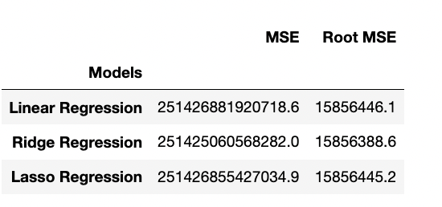
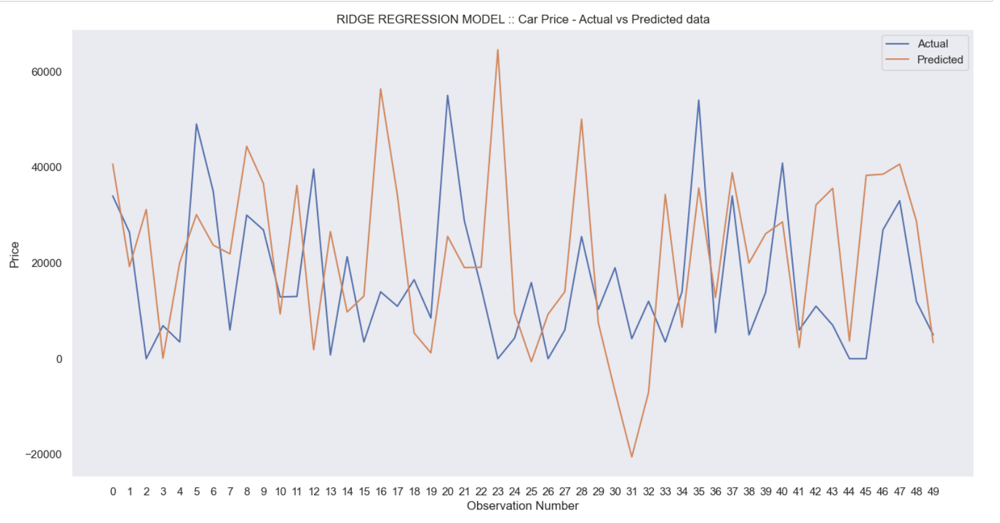

# Used Car Price price analysis and price prediction
An analysis of used vehicle dataset containing 426880 samples to understand the various features and their correlations on the vehicle price. 

## Contents
- Summary
- Objective
- Data Understanding
- Data Preparation
- Modeling
- Evaluation
- Insights
- Recommendations 

## Summary
Used vehicle sales have generally increased over the past 40 years. However, there have been some notable downturns, such as the recession of 2008-2009 and the COVID-19 pandemic in 2020. There are a number of factors that contribute to the demand for used vehicles. One is the cost of new vehicles have become increasingly expensive in recent years, making them out of reach for many consumers. Used vehicles offer a more affordable option for people who need a reliable vehicle.A nother factor that drives demand for used vehicles is the increasing reliability of used cars as they are now more reliable than ever before. This means that consumers can feel confident buying a used car without having to worry about it breaking down.

## Objective
Analyze the used vehicle dataset to understand the various factors that make a vehicle more or less expensive. Develop a price prediction model using three regression models - Linear, Ridge(GridSearchCV) and Lasso to predict vehicle price. Analyze the impact of core features like odometer, age, type, manufacturer, condition, drive type to examine the relationships and to understand the factors that decides the price.

## Data Understanding
Used vehicle dataset from Kaggle is used for analysis. Dataset contained 426,880 samples and after analyzing for missing, duplicate and non critical features, sample size is reduced to 97078. On analyzing what the data can tell, vehicles older than 1980, priced less than 1000 and more than 125k is been purged from the dataset. Outliers are removed to avoid overfitting or underfitting issues. 

## Data Preparation
Non numerical features are preprocessed using scikit-learn labelencoder, scaled and transformed to a degree of 2. GridSearchCV with 5-fold cross validation for analyzing hyperparameters.

## Modeling
Scikit-learn regression models - linear, ridge and Lasso models develop to identify the best model for price prediction.

## Evaluation

## Insights
Most used cars where found in CA, FL, NY, TX, OH and MI with average californa price around 14.8k
Ford, Chevolet, Toyota, Honda and Nissan have the maximum number of listings as they are majority sedan
Maximum number of vehicles are between 4 to 22 years old with majority sedan with automatic drive, fwd 
White, Black and Silver are the top colors with average white colored vehicle price around 17.2k and black colored around 16.2k
Pickup and trucks are selling for an average price of 23k, twice that of sedan
Vehicles less than 10k annual miles are mostly automatic, 
Most of the vehicles are gas, except for truck which mostly use diesel

## Recommendations
Pickup and SUV are command 60% higher price when compared to sedan
White and Black colored vehicles are lot more available than any other colors
Majority of the cars have put in less than 10k miles per year in 10 year range, thereby indicating that consumers are switching to newer vehicles. This gives an opportunity to source low odometer vehicles.
Average vehicle is about 10 - 12 years old, which might state that the vehicle can be used for another 10+ years
Sedan and SUV are the maxmimum vehicle types are available with clean title, automatic drive
Majority of the vehicles are automatic with very few manual shift. This indicates to source just the automatic transmission

